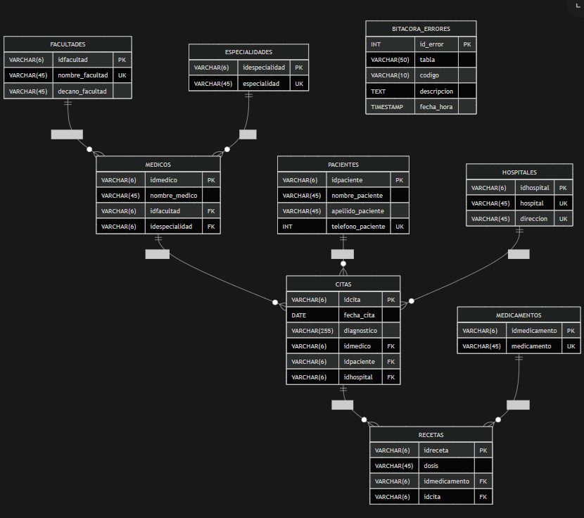

# Proyecto: Base de Datos para Clínica Universitaria

## Descripción del Proyecto

Este proyecto consiste en el diseño e implementación de una base de datos para una clínica universitaria, aplicando técnicas de normalización de datos hasta la **Cuarta Forma Normal (4FN)**. El objetivo principal es optimizar la estructura de datos eliminando redundancias y asegurando la integridad de la información.

### Objetivos Alcanzados

- Desarrollo del modelo de datos normalizado hasta 4FN
- Creación del modelo físico con todas las relaciones entre entidades
- Definición de tipos de datos y restricciones de integridad referencial
- Implementación de procedimientos almacenados para operaciones CRUD
- Desarrollo de funciones adicionales para consultas específicas:
  - Contar médicos por especialidad
  - Calcular pacientes atendidos por cada médico
  - Obtener cantidad de pacientes por sede hospitalaria
- Sistema de registro de errores con información de tabla, código, descripción y timestamp

---

## Proceso de Normalización

### Primera Forma Normal (1FN)

La **1FN** establece que cada campo debe contener valores atómicos, sin grupos repetitivos. Acciones realizadas:

- Separación de campos compuestos (nombre y apellido)
- Eliminación de campos multivaluados
- Reorganización de registros relacionados con medicamentos

### Segunda Forma Normal (2FN)

La **2FN** requiere que todo atributo no clave dependa completamente de la clave primaria. Se crearon las siguientes entidades:

- Pacientes
- Médicos
- Citas
- Recetas

La tabla de recetas almacena la dosis como atributo que depende de la combinación cita-medicamento.

### Tercera Forma Normal (3FN)

La **3FN** elimina dependencias transitivas. Se implementaron tablas catálogo:

- Especialidades
- Medicamentos
- Facultades
- Hospitales

Esto permite evitar redundancia y mantener datos uniformes.

### Cuarta Forma Normal (4FN)

La **4FN** elimina dependencias multivaluadas innecesarias. La relación médico-paciente se gestiona a través de la entidad citas, evitando tablas intermedias redundantes.

---

## Modelo de Datos

El modelo relacional fue diseñado utilizando **MySQL Workbench**, permitiendo visualizar entidades, atributos y relaciones. El modelo físico se generó automáticamente mediante Forward Engineering.

### Entidades Principales

| Entidad | Descripción |
|---------|-------------|
| pacientes | Información de pacientes registrados |
| medicos | Datos de los profesionales médicos |
| facultades | Facultades universitarias relacionadas |
| especialidades | Especialidades médicas disponibles |
| hospitales | Sedes hospitalarias |
| citas | Citas médicas programadas |
| recetas | Prescripciones de medicamentos |
| logs_errores | Registro de errores del sistema (procedimiento, tabla, código, mensaje, fecha/hora) |

